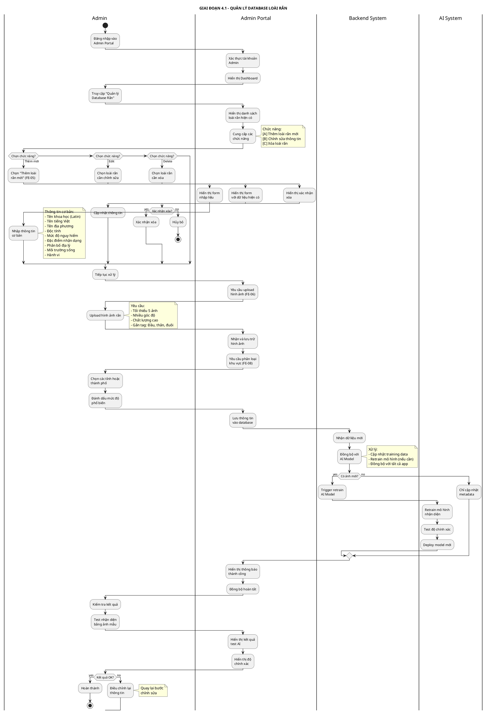
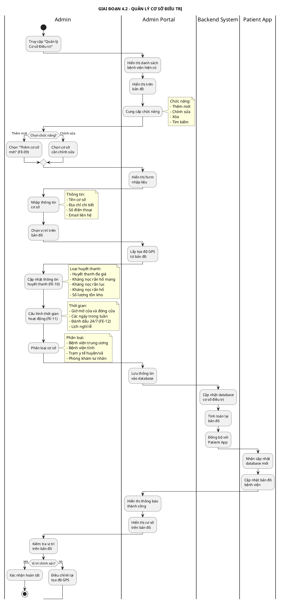
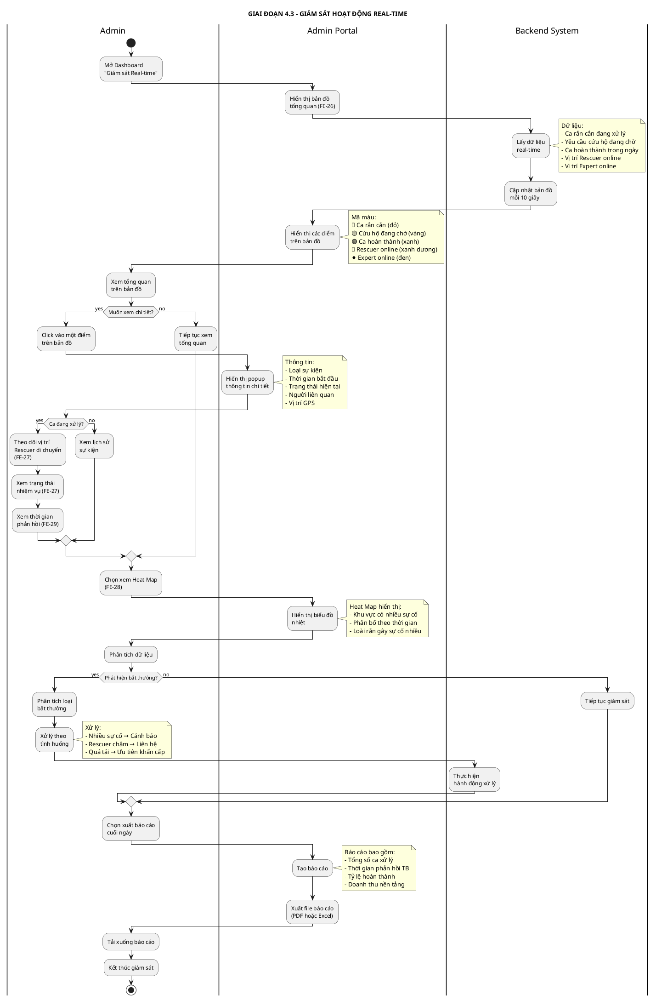
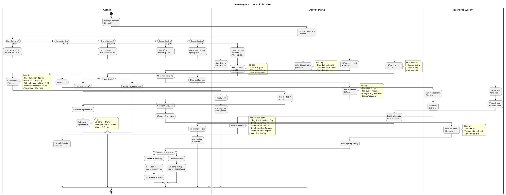

# SWIMLANE DIAGRAM - QUẢN TRỊ HỆ THỐNG (ADMIN)

## Thông tin dự án
- **Tên dự án:** AI-Powered Platform for Snakebite First Aid and Rescue Support (SnakeAid)
- **Module:** Admin Management System
- **Mục đích:** Minh họa quy trình quản trị hệ thống bao gồm quản lý database rắn, cơ sở điều trị, giám sát real-time và quản lý tài chính

---

## SWIMLANE DIAGRAM - LUỒNG CHÍNH (CHIA NHỎ THEO GIAI ĐOẠN)

### 4.1. GIAI ĐOẠN 1: QUẢN LÝ DATABASE LOÀI RẮN

**PlantUML Code:**



---

### 4.2. GIAI ĐOẠN 2: QUẢN LÝ CƠ SỞ ĐIỀU TRỊ

**PlantUML Code:**



---

### 4.3. GIAI ĐOẠN 3: GIÁM SÁT HOẠT ĐỘNG REAL-TIME

**PlantUML Code:**



---

### 4.4. GIAI ĐOẠN 4: QUẢN LÝ TÀI CHÍNH

**PlantUML Code:**



---

## TÓM TẮT CÁC GIAI ĐOẠN

| Giai đoạn | Tên | Chức năng chính | Thời gian ước tính |
|-----------|-----|-----------------|-------------------|
| **4.1** | Quản lý database loài rắn | Thêm, sửa, xóa thông tin rắn + Upload ảnh + Train AI | 10-20 phút/loài |
| **4.2** | Quản lý cơ sở điều trị | Thêm, sửa bệnh viện + Cập nhật huyết thanh + Cấu hình giờ hoạt động | 5-10 phút/cơ sở |
| **4.3** | Giám sát hoạt động real-time | Theo dõi bản đồ + Heat map + Xử lý bất thường + Xuất báo cáo | Liên tục |
| **4.4** | Quản lý tài chính | Thiết lập phí + Báo cáo doanh thu + Xử lý tranh chấp + Hoàn tiền | 5-30 phút/tác vụ |

---

## SWIMLANE DIAGRAM TỔNG HỢP (TẤT CẢ CÁC GIAI ĐOẠN)

### Phiên bản PlantUML đầy đủ

```plantuml
@startuml Complete-Admin-Management-Flow
title QUẢN TRỊ HỆ THỐNG - SWIMLANE DIAGRAM ĐẦY ĐỦ

|Admin|
start
:Đăng nhập Admin
Portal;

|Admin Portal|
:Hiển thị Dashboard
tổng quan;

|Admin|
if (Chọn module?) then (Database Rắn)
  :Quản lý database
  loài rắn;
  :Thêm hoặc sửa
  thông tin rắn;
  :Upload hình ảnh;
  
  |Backend System|
  :Đồng bộ với
  AI Model;
  :Retrain mô hình;
  
else (Cơ sở điều trị)
  :Quản lý bệnh viện;
  :Thêm hoặc sửa
  thông tin BV;
  :Cấu hình huyết thanh
  và giờ hoạt động;
  
  |Backend System|
  :Cập nhật database;
  :Đồng bộ với
  Patient App;
  
else (Giám sát)
  :Mở Dashboard
  real-time;
  :Xem bản đồ
  hoạt động;
  :Phân tích Heat Map;
  
  if (Phát hiện
  bất thường?) then (yes)
    :Xử lý bất thường;
    :Gửi cảnh báo
    cộng đồng;
  endif
  
  :Xuất báo cáo
  cuối ngày;
  
else (Tài chính)
  :Quản lý tài chính;
  
  if (Chức năng?) then (Thiết lập phí)
    :Cấu hình mức phí
    dịch vụ;
  else (Báo cáo)
    :Xem báo cáo
    doanh thu;
  else (Tranh chấp)
    :Xử lý khiếu nại;
    :Hoàn tiền nếu cần;
  endif
endif

|Admin Portal|
:Lưu thay đổi;
:Đồng bộ toàn hệ thống;

stop
@enduml
```

---

## CHÚ THÍCH

### Actors (Vai trò)
- **Admin:** Quản trị viên hệ thống
- **Admin Portal:** Giao diện web quản trị
- **Backend System:** Hệ thống backend xử lý dữ liệu
- **AI System:** Hệ thống AI nhận diện rắn
- **Patient App:** Ứng dụng người dùng cuối

### Quyền hạn Admin
1. **Super Admin:**
   - Toàn quyền trên hệ thống
   - Quản lý tất cả module
   - Xử lý tranh chấp cao cấp
   - Xuất báo cáo tài chính

2. **Content Admin:**
   - Quản lý database rắn
   - Quản lý cơ sở điều trị
   - Không truy cập tài chính

3. **Support Admin:**
   - Giám sát hoạt động
   - Xử lý khiếu nại người dùng
   - Không sửa database

### Tính năng nâng cao

#### 4.1. Quản lý Database Rắn
- **Import/Export:** Nhập xuất dữ liệu hàng loạt (CSV, Excel)
- **Version Control:** Theo dõi lịch sử thay đổi dữ liệu
- **AI Accuracy Report:** Báo cáo độ chính xác nhận diện theo loài
- **Image Quality Check:** Tự động kiểm tra chất lượng ảnh upload

#### 4.2. Quản lý Cơ sở Điều trị
- **Auto-sync với Google Maps:** Tự động lấy thông tin từ Google Maps
- **Inventory Management:** Quản lý tồn kho huyết thanh
- **Alert System:** Cảnh báo khi huyết thanh sắp hết
- **Verification Status:** Đánh dấu cơ sở đã xác minh

#### 4.3. Giám sát Real-time
- **Multi-screen Dashboard:** Hỗ trợ nhiều màn hình giám sát
- **Alert Thresholds:** Cấu hình ngưỡng cảnh báo tự động
- **Historical Playback:** Xem lại lịch sử di chuyển Rescuer
- **Performance Metrics:** Đo lường hiệu suất từng Rescuer/Expert

#### 4.4. Quản lý Tài chính
- **Automated Reconciliation:** Đối soát tự động với cổng thanh toán
- **Tax Reports:** Báo cáo thuế theo quy định
- **Commission Rules:** Cấu hình quy tắc hoa hồng linh hoạt
- **Fraud Detection:** Phát hiện giao dịch bất thường

### API Endpoints liên quan

#### Database Management
- `POST /api/admin/snake/create` - Tạo loài rắn mới
- `PUT /api/admin/snake/:id/update` - Cập nhật thông tin rắn
- `DELETE /api/admin/snake/:id/delete` - Xóa loài rắn
- `POST /api/admin/snake/:id/upload-images` - Upload ảnh rắn
- `POST /api/admin/snake/retrain-ai` - Trigger retrain AI model

#### Hospital Management
- `POST /api/admin/hospital/create` - Thêm bệnh viện mới
- `PUT /api/admin/hospital/:id/update` - Cập nhật thông tin BV
- `PUT /api/admin/hospital/:id/antivenom` - Cập nhật huyết thanh
- `PUT /api/admin/hospital/:id/schedule` - Cấu hình giờ hoạt động

#### Monitoring
- `GET /api/admin/monitoring/realtime` - Lấy dữ liệu real-time
- `GET /api/admin/monitoring/heatmap` - Lấy dữ liệu heat map
- `GET /api/admin/monitoring/report/daily` - Báo cáo cuối ngày
- `POST /api/admin/alert/community` - Gửi cảnh báo cộng đồng

#### Financial
- `PUT /api/admin/finance/fees` - Cấu hình phí dịch vụ
- `GET /api/admin/finance/revenue` - Báo cáo doanh thu
- `GET /api/admin/finance/transactions` - Danh sách giao dịch
- `POST /api/admin/finance/refund` - Xử lý hoàn tiền
- `PUT /api/admin/finance/dispute/:id/resolve` - Giải quyết tranh chấp

### Báo cáo và Analytics

#### Daily Report
- Tổng số ca xử lý trong ngày
- Thời gian phản hồi trung bình
- Tỷ lệ thành công
- Top 5 loài rắn gây sự cố
- Doanh thu trong ngày

#### Weekly Report
- Xu hướng số lượng sự cố
- So sánh với tuần trước
- Hiệu suất Rescuer/Expert
- Phân bố địa lý sự cố
- Tỷ lệ hài lòng khách hàng

#### Monthly Report
- Tổng quan tháng
- Doanh thu và lợi nhuận
- Growth rate
- User retention
- Top performers (Rescuer/Expert)

#### Quarterly/Yearly Report
- Báo cáo tổng hợp cho Ban Giám đốc
- Phân tích xu hướng dài hạn
- Đề xuất chiến lược
- Budget planning

---

**Ghi chú:** Các feature code (FE-XX) tham chiếu đến file `Major-Features-Summary.md`
