```plantuml
@startuml Stage-1-Initial-Response
title GIAI ĐOẠN 1.1 - PHÁT HIỆN VÀ XỬ LÝ BAN ĐẦU

|Patient|
start
:Bị rắn cắn;
:Mở app SnakeAid;

|Mobile App|
:Hiển thị hướng dẫn
sơ cứu ngay lập tức;
note right
  FE-01: Băng ép từng bước
  FE-02: Hình ảnh minh họa
  FE-03: Cảnh báo hành động cấm kỵ
end note

|Patient|
:Thực hiện sơ cứu
theo hướng dẫn;
:Chụp ảnh rắn
(nếu có thể);

|Mobile App|
:Nhận ảnh rắn;

|AI System|
:Xử lý ảnh bằng
CNN Model;
:So sánh với
database loài rắn;
:Trả về kết quả
nhận diện;

|Mobile App|
:Hiển thị kết quả;
note right
  FE-12: Tên rắn
  FE-13: Độc tính
  FE-14: Biện pháp sơ cứu
end note

|Patient|
:Xem thông tin
loài rắn;

stop
@enduml
```

```plantuml
@startuml Stage-2-Severity-Assessment
title GIAI ĐOẠN 1.2 - ĐÁNH GIÁ MỨC ĐỘ NGHIÊM TRỌNG

|Patient|
start
:Chụp ảnh vết cắn;
:Nhập triệu chứng
(đau, sưng, tê...);

|Mobile App|
:Nhận dữ liệu
vết cắn + triệu chứng;

|AI System|
:Phân tích ảnh
vết cắn;
:Đánh giá triệu chứng;
:Kết hợp thông tin
loài rắn;
:Tính điểm nghiêm trọng
(0-100);
:Phân loại mức độ
(Nhẹ, Trung bình,
Nặng, Nguy kịch);

|Mobile App|
:Nhận kết quả
đánh giá;

|Backend System|
:Lưu thông tin sự cố;
:Tạo Emergency Case;
:Sinh CaseID;
note right
  Lưu:
  - Ảnh rắn
  - Ảnh vết cắn
  - Triệu chứng
  - Kết quả AI
  - Timestamp
end note

|Mobile App|
:Nhận CaseID;
:Hiển thị mức độ
nghiêm trọng;

if (Mức độ Nặng hoặc Nguy kịch?) then (yes)
  :Hiển thị cảnh báo
  khẩn cấp (FE-16);
  :Hiển thị nút SOS
  nổi bật;
  note right
    Chuyển sang
    Giai đoạn 1.3
  end note
else (no)
  :Hướng dẫn tiếp tục
  sơ cứu;
  :Đề xuất tìm
  bệnh viện;
  note right
    Chuyển sang
    Giai đoạn 1.4
  end note
endif

stop
@enduml
```

```plantuml
@startuml Stage-3-Emergency-SOS
title GIAI ĐOẠN 1.3 - KÍCH HOẠT SOS VÀ GỌI CẤP CỨU

|Patient|
start
:Nhấn nút SOS
(FE-04);

|Mobile App|
:Lấy vị trí GPS
hiện tại;
:Chuẩn bị thông tin
khẩn cấp;

fork
  |Emergency Service|
  :Nhận cuộc gọi
  từ app;
  :Nhận SMS với
  tọa độ GPS;
  note right
    SMS bao gồm:
    - Tọa độ GPS
    - Link tracking
    - Thông tin sơ bộ
  end note
  :Tiếp nhận
  cuộc gọi;
  :Xác nhận đã nhận
  thông tin;
fork again
  |Backend System|
  :Kích hoạt
  GPS tracking;
  :Tạo session
  theo dõi real-time;
  :Cập nhật vị trí
  mỗi 10 giây;
  
  |Emergency Service|
  :Nhận link
  tracking GPS;
fork again
  |Backend System|
  :Chuẩn bị
  Emergency Package;
  :Gửi thông tin chi tiết:;
  note right
    Emergency Package:
    - CaseID
    - Loài rắn nhận diện
    - Ảnh vết cắn
    - Triệu chứng
    - Mức độ nghiêm trọng
    - Thông tin bệnh nhân
    - Vị trí GPS
  end note
  
  |Emergency Service|
  :Nhận Emergency
  Package đầy đủ;
  :Chuẩn bị xuất
  xe cấp cứu;
end fork

|Emergency Service|
:Gửi xác nhận:
"Xe cấp cứu đang đến";

|Mobile App|
:Hiển thị màn hình
chờ cấp cứu;
note right
  Hiển thị:
  - Timer đếm thời gian
  - Vị trí GPS
  - Hướng dẫn sơ cứu
  - Trạng thái cấp cứu
end note

|Patient|
:Xem trạng thái
chờ cấp cứu;
:Tiếp tục sơ cứu
theo hướng dẫn;

|Backend System|
if (Đã cấu hình\nngười thân?) then (yes)
  :Gửi SMS + Push
  notification đến
  người thân;
  note right
    Thông báo khẩn cấp:
    - Người thân bị rắn cắn
    - Vị trí hiện tại
    - Tình trạng
    - Link theo dõi
  end note
else (no)
  :Bỏ qua bước này;
endif

stop
@enduml
```

```plantuml
@startuml Stage-4-Find-Hospital
title GIAI ĐOẠN 1.4 - TÌM CƠ SỞ ĐIỀU TRỊ GẦN NHẤT

|Patient|
start
:Chọn "Tìm bệnh viện
gần nhất";

|Mobile App|
:Lấy vị trí GPS
hiện tại;

|Hospital Database|
:Nhận yêu cầu
truy vấn;
:Query: Tìm BV có
huyết thanh;
note right
  SELECT hospitals
  WHERE has_antivenom = true
    AND distance < 20km
  ORDER BY distance ASC
end note
:Trả về danh sách
bệnh viện;

|Mobile App|
:Nhận danh sách
bệnh viện;
:Tính khoảng cách
và thời gian (FE-07);
:Lọc theo loại
huyết thanh (FE-08);
:Đánh dấu BV
mở cửa 24/7;
:Sắp xếp theo
khoảng cách;

|Patient|
:Xem bản đồ +
danh sách BV;
note right
  Hiển thị:
  - Vị trí trên bản đồ
  - Khoảng cách (km)
  - Thời gian ước tính
  - Loại huyết thanh
  - Giờ mở cửa
  - Đánh giá (rating)
end note
:Chọn một bệnh viện;

|Mobile App|
:Hiển thị chi tiết
bệnh viện;
note right
  Chi tiết:
  - Tên bệnh viện
  - Địa chỉ đầy đủ
  - Số điện thoại
  - Nút "Chỉ đường"
  - Nút "Gọi điện"
end note

|Patient|
if (Chọn hành động?) then (Chỉ đường)
  |Mobile App|
  :Mở Google Maps hoặc
  Apple Maps;
  :Điều hướng đến
  bệnh viện;
  
  |Patient|
  :Di chuyển đến
  bệnh viện;
else (Gọi điện)
  |Mobile App|
  :Gọi số điện thoại
  bệnh viện;
  
  |Patient|
  :Trao đổi với
  bệnh viện;
endif

|Backend System|
:Lưu lịch sử
hành động (FE-11);
:UPDATE emergency_case;
note right
  UPDATE:
  - selected_hospital_id
  - action_taken
  - selected_at timestamp
end note

|Mobile App|
:Xác nhận đã lưu
lịch sử;

|Patient|
:Kết thúc quy trình
tìm bệnh viện;

stop
@enduml
```

# SWIMLANE DIAGRAM - XỬ LÝ SỰ CỐ RẮN CẮN KHẨN CẤP

## Thông tin sơ đồ
- **Tên luồng:** Xử lý sự cố rắn cắn khẩn cấp
- **Mục đích:** Mô tả chi tiết tương tác giữa các actor trong tình huống khẩn cấp
- **Các actor tham gia:** Patient, Mobile App, AI System, Backend System, Emergency Service, Hospital Database

---

## SWIMLANE DIAGRAM - LUỒNG CHÍNH (CHIA NHỎ THEO GIAI ĐOẠN)

### 1.1. GIAI ĐOẠN 1: PHÁT HIỆN VÀ XỬ LÝ BAN ĐẦU

**PlantUML Code:**



---

### 1.2. GIAI ĐOẠN 2: ĐÁNH GIÁ MỨC ĐỘ NGHIÊM TRỌNG

**PlantUML Code:**



---

### 1.3. GIAI ĐOẠN 3: KÍCH HOẠT SOS VÀ GỌI CẤP CỨU

**PlantUML Code:**



---

### 1.4. GIAI ĐOẠN 4: TÌM CƠ SỞ ĐIỀU TRỊ GẦN NHẤT

**PlantUML Code:**



---

## TÓM TẮT CÁC GIAI ĐOẠN

| Giai đoạn | Tên | Actors chính | Thời gian ước tính |
|-----------|-----|--------------|-------------------|
| **1.1** | Phát hiện và xử lý ban đầu | Patient, Mobile App, AI System | 30-60 giây |
| **1.2** | Đánh giá mức độ nghiêm trọng | Patient, Mobile App, AI System, Backend | 30-45 giây |
| **1.3** | Kích hoạt SOS và gọi cấp cứu | Patient, Mobile App, Backend, Emergency Service | 10-15 giây |
| **1.4** | Tìm cơ sở điều trị gần nhất | Patient, Mobile App, Hospital Database, Backend | 20-30 giây |

---

## SWIMLANE DIAGRAM TỔNG HỢP (TẤT CẢ CÁC GIAI ĐOẠN)

### Phiên bản PlantUML đầy đủ

```plantuml
@startuml Complete-Emergency-Flow
title XỬ LÝ SỰ CỐ RẮN CẮN KHẨN CẤP - SWIMLANE DIAGRAM ĐẦY ĐỦ

|Patient|
:Chụp ảnh vết cắn;
:Nhập triệu chứng (đau, sưng, tê...);

|Mobile App|
:Nhận dữ liệu vết cắn + triệu chứng;

|AI System|
:Phân tích ảnh vết cắn;
:Đánh giá triệu chứng;
:Kết hợp thông tin loài rắn;
:Tính điểm nghiêm trọng (0-100);
:Phân loại mức độ;

|Backend System|
:Lưu thông tin sự cố;
:Tạo CaseID;

|Mobile App|
if (Mức độ nặng hoặc nguy kịch?) then (YES)
  :Hiển thị cảnh báo khẩn cấp (FE-16);
  :Hiển thị nút SOS;

  |Patient|
  :Nhấn nút SOS (FE-04);

  |Mobile App|
  :Lấy vị trí GPS;
  :Chuẩn bị dữ liệu khẩn cấp;

  fork
    |Emergency Service|
    :Gọi điện đến 115;
    :Gửi SMS GPS;
    :Tiếp nhận cuộc gọi;
    :Xác nhận;
  fork again
    |Backend System|
    :Kích hoạt GPS tracking;
    :Tạo session theo dõi real-time;
    :Gửi link tracking cho 115;
  fork again
    |Backend System|
    :Gửi Emergency Package;
    :Chuyển tiếp thông tin:
    - Loài rắn
    - Vết cắn
    - Triệu chứng
    - Mức độ
    - CaseID;
  end fork

  |Patient|
  :Nhận thông báo "Xe cấp cứu đang đến";
  :Màn hình chờ cấp cứu;

else (NO)
  :Hướng dẫn tiếp tục sơ cứu;

  |Patient|
  :Chọn "Tìm bệnh viện gần nhất";

  |Mobile App|
  :Lấy vị trí GPS;

  |Hospital Database|
  :Tìm BV có huyết thanh trong bán kính 20km;
  :Trả về danh sách bệnh viện;

  |Mobile App|
  :Tính khoảng cách thời gian (FE-07);
  :Lọc theo loại huyết thanh (FE-08);
  :Đánh dấu BV mở cửa 24/7;
  :Hiển thị bản đồ + danh sách;

  |Patient|
  :Xem danh sách bệnh viện;
  :Chọn một bệnh viện;

  |Mobile App|
  :Hiển thị chi tiết BV;

  |Patient|
  if (Chọn hành động?) then (Chỉ đường)
    |Mobile App|
    :Mở Google Maps / Apple Maps;
  else (Gọi điện)
    |Mobile App|
    :Gọi số điện thoại bệnh viện;
  endif

  |Backend System|
  :Lưu lịch sử hành động (FE-11);
  :UPDATE case selected_hospital;
endif

stop
@enduml

```



### Hướng dẫn sử dụng PlantUML

**Cách 1: Sử dụng VS Code Extension**
1. Cài đặt extension "PlantUML" trong VS Code
2. Cài đặt Java (PlantUML cần Java để chạy)
3. Mở file này và nhấn `Alt+D` để xem preview

**Cách 2: Sử dụng Online Editor**
1. Truy cập: https://www.plantuml.com/plantuml/uml/
2. Copy toàn bộ code PlantUML ở trên
3. Paste vào editor và xem kết quả

**Cách 3: Sử dụng Command Line**
```bash
# Cài đặt PlantUML
npm install -g node-plantuml

# Generate PNG
plantuml Swimlane-Emergency-Flow.md

# Generate SVG
plantuml -tsvg Swimlane-Emergency-Flow.md
```

## MÔ TẢ CHI TIẾT CÁC GIAI ĐOẠN

### GIAI ĐOẠN 1: Phát hiện và xử lý ban đầu (30-60 giây)

| Bước | Actor | Hành động | Feature | Thời gian |
|------|-------|-----------|---------|-----------|
| 1.1 | Patient | Mở app, chọn "Tôi bị rắn cắn" | - | < 5s |
| 1.2 | Mobile App | Hiển thị hướng dẫn sơ cứu ngay | FE-01, FE-02, FE-03 | Ngay lập tức |
| 1.3 | Patient | Thực hiện sơ cứu theo hướng dẫn | - | 2-3 phút |
| 1.4 | Mobile App | Yêu cầu chụp ảnh rắn | - | - |
| 1.5 | Patient | Chụp và upload ảnh rắn | - | 10-20s |
| 1.6 | AI System | Nhận diện loài rắn | FE-12, FE-13, FE-14 | < 5s |
| 1.7 | Mobile App | Hiển thị kết quả nhận diện | FE-12, FE-13, FE-14 | Ngay lập tức |

**Đầu vào:**
- Ảnh rắn (optional)
- Thông tin vị trí GPS

**Đầu ra:**
- Hướng dẫn sơ cứu ban đầu
- Kết quả nhận diện loài rắn (nếu có ảnh)
- Đề xuất biện pháp xử lý

**Quyết định tiếp theo:**
→ Chuyển sang Giai đoạn 2: Đánh giá mức độ nghiêm trọng

---

### GIAI ĐOẠN 2: Đánh giá mức độ nghiêm trọng (30-45 giây)

| Bước | Actor | Hành động | Feature | Thời gian |
|------|-------|-----------|---------|-----------|
| 2.1 | Mobile App | Yêu cầu chụp ảnh vết cắn | - | - |
| 2.2 | Patient | Chụp và upload ảnh vết cắn | FE-10 | 10-15s |
| 2.3 | Mobile App | Yêu cầu nhập triệu chứng | - | - |
| 2.4 | Patient | Nhập triệu chứng | FE-09 | 15-30s |
| 2.5 | AI System | Phân tích và đánh giá | FE-15, FE-17 | < 3s |
| 2.6 | Backend System | Lưu thông tin sự cố | FE-11 | < 2s |
| 2.7 | Mobile App | Hiển thị mức độ nghiêm trọng | FE-15, FE-16, FE-17 | Ngay lập tức |

**Đầu vào:**
- Ảnh vết cắn
- Mô tả triệu chứng (text)
- Thông tin loài rắn (từ Giai đoạn 1)

**Xử lý AI:**
```
Điểm mức độ nghiêm trọng = 
    0.4 × (Độc tính của rắn) +
    0.3 × (Mức độ sưng tấy từ ảnh) +
    0.2 × (Số lượng triệu chứng nghiêm trọng) +
    0.1 × (Thời gian từ khi bị cắn)

Phân loại:
- 0-25: Nhẹ
- 26-50: Trung bình
- 51-75: Nặng
- 76-100: Nguy kịch
```

**Đầu ra:**
- Mức độ nghiêm trọng: Nhẹ / Trung bình / Nặng / Nguy kịch
- CaseID (để theo dõi)
- Timestamp

**Quyết định tiếp theo:**
- **Nếu Nặng hoặc Nguy kịch** → Giai đoạn 3: Gọi cấp cứu
- **Nếu Nhẹ hoặc Trung bình** → Giai đoạn 4: Tìm bệnh viện

---

### GIAI ĐOẠN 3: Kích hoạt SOS và gọi cấp cứu (10-15 giây)

| Bước | Actor | Hành động | Feature | Thời gian |
|------|-------|-----------|---------|-----------|
| 3.1 | Mobile App | Hiển thị cảnh báo khẩn cấp | FE-16 | Ngay lập tức |
| 3.2 | Patient | Nhấn nút SOS | FE-04 | < 2s |
| 3.3 | Mobile App | Lấy GPS và chuẩn bị dữ liệu | - | < 1s |
| 3.4 | Mobile App | Gọi điện + Gửi SMS đến 115 | FE-04 | < 3s |
| 3.5 | Mobile App | Kích hoạt GPS tracking | FE-05 | < 2s |
| 3.6 | Backend System | Gửi thông tin bổ sung đến 115 | FE-05 | < 3s |
| 3.7 | Emergency Service | Xác nhận đã nhận | - | Ngay lập tức |
| 3.8 | Mobile App | Hiển thị màn hình chờ | - | - |
| 3.9 | Backend System | Gửi thông báo người thân (optional) | - | < 5s |

**Đầu vào:**
- Vị trí GPS hiện tại
- CaseID (từ Giai đoạn 2)
- Thông tin đầy đủ về sự cố

**Gói dữ liệu gửi đến 115 (Emergency Package):**
```json
{
  "case_id": "CASE-20231123-001",
  "timestamp": "2023-11-23T14:30:45Z",
  "location": {
    "latitude": 10.762622,
    "longitude": 106.660172,
    "address": "123 Nguyễn Văn Linh, Q7, TP.HCM"
  },
  "patient": {
    "name": "Nguyễn Văn A",
    "phone": "0901234567",
    "age": 35,
    "gender": "Nam"
  },
  "incident": {
    "type": "snakebite",
    "snake_species": "Rắn hổ mang (Naja kaouthia)",
    "toxicity": "Highly Venomous",
    "severity": "Critical",
    "severity_score": 85,
    "time_since_bite": "15 minutes"
  },
  "symptoms": [
    "Đau dữ dội tại vết cắn",
    "Sưng tấy lan nhanh",
    "Tê liệt",
    "Khó thở"
  ],
  "first_aid_done": [
    "Băng ép",
    "Giữ yên"
  ],
  "images": {
    "snake_photo": "https://snakeaid.com/img/case-001-snake.jpg",
    "bite_photo": "https://snakeaid.com/img/case-001-bite.jpg"
  },
  "tracking_link": "https://snakeaid.com/track/CASE-20231123-001"
}
```

**Đầu ra:**
- Cuộc gọi đến 115 được kết nối
- SMS chứa GPS đã gửi
- Link theo dõi real-time đã gửi
- Thông báo người thân (nếu có)

**Parallel Processing:**
Hệ thống thực hiện 3 tác vụ song song:
1. Gọi điện + SMS
2. Chia sẻ vị trí real-time
3. Gửi thông tin bổ sung

**Kết thúc:**
Chuyển sang chế độ chờ cấp cứu, tiếp tục hiển thị hướng dẫn sơ cứu.

---

### GIAI ĐOẠN 4: Tìm cơ sở điều trị gần nhất (20-30 giây)

| Bước | Actor | Hành động | Feature | Thời gian |
|------|-------|-----------|---------|-----------|
| 4.1 | Patient | Chọn "Tìm bệnh viện gần nhất" | - | < 2s |
| 4.2 | Mobile App | Lấy vị trí GPS | - | < 1s |
| 4.3 | Hospital Database | Truy vấn cơ sở điều trị | FE-06 | < 2s |
| 4.4 | Mobile App | Xử lý và hiển thị kết quả | FE-06, FE-07, FE-08 | < 3s |
| 4.5 | Patient | Xem danh sách và chọn bệnh viện | - | 10-20s |
| 4.6 | Mobile App | Hiển thị chi tiết bệnh viện | - | Ngay lập tức |
| 4.7 | Patient | Chọn "Chỉ đường" hoặc "Gọi điện" | - | < 2s |
| 4.8 | Backend System | Lưu lịch sử | FE-11 | < 2s |

**Query Database:**
```sql
SELECT 
    h.name,
    h.address,
    h.phone,
    h.gps_lat,
    h.gps_long,
    h.open_24_7,
    a.antivenom_types,
    a.stock_quantity,
    ST_Distance(
        ST_GeogFromText('POINT(' || :patient_long || ' ' || :patient_lat || ')'),
        ST_GeogFromText('POINT(' || h.gps_long || ' ' || h.gps_lat || ')')
    ) / 1000 AS distance_km
FROM hospitals h
LEFT JOIN antivenom_stock a ON h.id = a.hospital_id
WHERE h.has_antivenom = true
    AND ST_Distance(
        ST_GeogFromText('POINT(' || :patient_long || ' ' || :patient_lat || ')'),
        ST_GeogFromText('POINT(' || h.gps_long || ' ' || h.gps_lat || ')')
    ) / 1000 <= 20
ORDER BY distance_km ASC
LIMIT 10;
```

**Đầu vào:**
- Vị trí GPS Patient
- Loài rắn (để lọc loại huyết thanh phù hợp)

**Xử lý dữ liệu:**
- Tính khoảng cách theo công thức Haversine
- Ước tính thời gian di chuyển (distance_km ÷ 40km/h × 60 phút)
- Lọc cơ sở có huyết thanh phù hợp
- Đánh dấu cơ sở mở cửa 24/7
- Sắp xếp theo khoảng cách

**Đầu ra:**
```json
{
  "patient_location": {
    "latitude": 10.762622,
    "longitude": 106.660172
  },
  "hospitals": [
    {
      "id": "H001",
      "name": "Bệnh viện Chợ Rẫy",
      "address": "201B Nguyễn Chí Thanh, Q5, TP.HCM",
      "phone": "02838554137",
      "distance_km": 4.2,
      "estimated_time": "7 phút",
      "open_24_7": true,
      "antivenom_available": [
        "Huyết thanh đa giá",
        "Huyết thanh kháng nọc rắn hổ mang",
        "Huyết thanh kháng nọc rắn lục"
      ],
      "stock_status": "In Stock",
      "rating": 4.8
    },
    {
      "id": "H002",
      "name": "Bệnh viện Nhân Dân 115",
      "address": "527 Sư Vạn Hạnh, Q10, TP.HCM",
      "phone": "02838650222",
      "distance_km": 6.8,
      "estimated_time": "11 phút",
      "open_24_7": true,
      "antivenom_available": [
        "Huyết thanh đa giá",
        "Huyết thanh kháng nọc rắn hổ"
      ],
      "stock_status": "In Stock",
      "rating": 4.6
    }
  ]
}
```

**Hiển thị trên UI:**
- Bản đồ với markers cho từng bệnh viện
- Danh sách bệnh viện dạng card
- Thông tin: Tên, khoảng cách, thời gian, huyết thanh
- Nút "Chỉ đường" và "Gọi điện"

**Lưu lịch sử:**
- Cập nhật Case record với thông tin bệnh viện được chọn
- Thời gian chọn bệnh viện
- Hành động tiếp theo (chỉ đường/gọi điện)

---

## BẢNG TỔNG HỢP THỜI GIAN XỬ LÝ

| Giai đoạn | Thời gian tối thiểu | Thời gian tối đa | Thời gian trung bình |
|-----------|---------------------|------------------|----------------------|
| Giai đoạn 1: Phát hiện và xử lý ban đầu | 30 giây | 3 phút | 1 phút |
| Giai đoạn 2: Đánh giá mức độ nghiêm trọng | 30 giây | 1 phút | 45 giây |
| Giai đoạn 3: Kích hoạt SOS (nếu cần) | 10 giây | 20 giây | 15 giây |
| Giai đoạn 4: Tìm bệnh viện (nếu cần) | 20 giây | 1 phút | 30 giây |
| **TỔNG** | **1.5 phút** | **5.5 phút** | **2.5 phút** |

**Ghi chú:**
- Thời gian trên chưa tính thời gian Patient thực hiện sơ cứu (2-3 phút)
- Thời gian AI xử lý: < 5 giây cho mỗi lần phân tích
- Thời gian query database: < 2 giây
- Thời gian chờ cấp cứu không tính trong luồng này

---

## SƠ ĐỒ RA QUYẾT ĐỊNH (DECISION TREE)

```
                    ┌─────────────────┐
                    │  Người bị rắn   │
                    │      cắn        │
                    └────────┬────────┘
                             │
                             ▼
                    ┌─────────────────┐
                    │   Mở SnakeAid   │
                    │      App        │
                    └────────┬────────┘
                             │
                             ▼
                    ┌─────────────────┐
                    │  Hướng dẫn sơ   │
                    │  cứu ngay lập   │
                    │      tức        │
                    └────────┬────────┘
                             │
                             ▼
               ┌─────────────┴─────────────┐
               │ Có ảnh rắn không?        │
               └──┬──────────────────┬────┘
                  │ Có               │ Không
                  ▼                  ▼
          ┌──────────────┐    ┌──────────────┐
          │ AI nhận diện │    │ Bỏ qua bước │
          │    loài      │    │     này      │
          └──────┬───────┘    └──────┬───────┘
                 │                   │
                 └─────────┬─────────┘
                           ▼
                  ┌─────────────────┐
                  │ Chụp vết cắn +  │
                  │ Nhập triệu chứng│
                  └────────┬────────┘
                           │
                           ▼
                  ┌─────────────────┐
                  │  AI đánh giá    │
                  │  mức độ nghiêm  │
                  │      trọng      │
                  └────────┬────────┘
                           │
            ┌──────────────┴──────────────┐
            │                             │
            ▼                             ▼
    ┌───────────────┐           ┌───────────────┐
    │ Mức độ NẶNG   │           │ Mức độ NHẸ    │
    │ hoặc NGUY KỊCH│           │ hoặc TRUNG    │
    │               │           │     BÌNH      │
    └───────┬───────┘           └───────┬───────┘
            │                           │
            ▼                           ▼
    ┌───────────────┐           ┌───────────────┐
    │ Cảnh báo khẩn │           │ Tìm bệnh viện │
    │     cấp       │           │  gần nhất     │
    └───────┬───────┘           └───────┬───────┘
            │                           │
            ▼                           ▼
    ┌───────────────┐           ┌───────────────┐
    │ Nhấn nút SOS  │           │ Hiển thị danh │
    └───────┬───────┘           │  sách BV có   │
            │                   │  huyết thanh  │
            ▼                   └───────┬───────┘
    ┌───────────────┐                   │
    │ Gọi 115 +     │                   ▼
    │ GPS tracking  │           ┌───────────────┐
    └───────┬───────┘           │ Chọn BV →     │
            │                   │ Chỉ đường     │
            ▼                   └───────────────┘
    ┌───────────────┐
    │ Chờ cấp cứu   │
    │ đến           │
    └───────────────┘
```

---

## YÊU CẦU KỸ THUẬT

### Performance Requirements

| Chỉ số | Yêu cầu | Ghi chú |
|--------|---------|---------|
| AI nhận diện rắn | < 5 giây | 95% trường hợp |
| AI đánh giá mức độ | < 3 giây | 98% trường hợp |
| Query database bệnh viện | < 2 giây | 99% trường hợp |
| Lưu thông tin sự cố | < 2 giây | 99.9% trường hợp |
| Kích hoạt SOS | < 10 giây | Từ lúc nhấn nút đến gọi 115 |
| GPS tracking update | Mỗi 10 giây | Khi đã kích hoạt SOS |

### Data Storage

**Emergency Case Record:**
```sql
CREATE TABLE emergency_cases (
    case_id VARCHAR(50) PRIMARY KEY,
    patient_id INT,
    created_at TIMESTAMP,
    
    -- Thông tin rắn
    snake_species VARCHAR(200),
    snake_photo_url VARCHAR(500),
    ai_confidence_score DECIMAL(5,2),
    
    -- Thông tin vết cắn
    bite_photo_url VARCHAR(500),
    symptoms TEXT,
    severity_level VARCHAR(20),
    severity_score INT,
    
    -- Vị trí
    gps_latitude DECIMAL(10,8),
    gps_longitude DECIMAL(11,8),
    address TEXT,
    
    -- Hành động
    sos_activated BOOLEAN,
    sos_activated_at TIMESTAMP,
    emergency_call_status VARCHAR(50),
    
    -- Bệnh viện
    selected_hospital_id VARCHAR(50),
    selected_at TIMESTAMP,
    
    -- Kết quả
    status VARCHAR(50), -- active, resolved, closed
    resolved_at TIMESTAMP,
    outcome TEXT
);
```

### API Endpoints

**1. Nhận diện rắn:**
```
POST /api/v1/ai/identify-snake
Content-Type: multipart/form-data

Request:
- image: File (JPEG/PNG, max 10MB)
- gps_lat: Number (optional)
- gps_long: Number (optional)

Response:
{
  "success": true,
  "data": {
    "species": "Naja kaouthia",
    "common_name": "Rắn hổ mang",
    "toxicity": "highly_venomous",
    "confidence": 0.94,
    "characteristics": "...",
    "first_aid": "..."
  },
  "processing_time_ms": 3245
}
```

**2. Đánh giá mức độ nghiêm trọng:**
```
POST /api/v1/ai/assess-severity
Content-Type: application/json

Request:
{
  "case_id": "CASE-20231123-001",
  "snake_species": "Naja kaouthia",
  "bite_image": "base64_encoded_string",
  "symptoms": ["pain", "swelling", "numbness", "difficulty_breathing"],
  "time_since_bite_minutes": 15
}

Response:
{
  "success": true,
  "data": {
    "severity_level": "critical",
    "severity_score": 85,
    "recommendation": "call_emergency_immediately",
    "risk_factors": [
      "Highly venomous snake",
      "Multiple severe symptoms",
      "Rapid swelling progression"
    ]
  },
  "processing_time_ms": 2134
}
```

**3. Tìm bệnh viện:**
```
GET /api/v1/hospitals/nearby
Query Parameters:
- lat: 10.762622
- long: 106.660172
- radius_km: 20
- has_antivenom: true

Response:
{
  "success": true,
  "data": {
    "patient_location": {...},
    "hospitals": [...]
  },
  "total": 8,
  "query_time_ms": 1523
}
```

**4. Kích hoạt SOS:**
```
POST /api/v1/emergency/activate-sos
Content-Type: application/json

Request:
{
  "case_id": "CASE-20231123-001",
  "patient_id": 12345,
  "gps_lat": 10.762622,
  "gps_long": 106.660172
}

Response:
{
  "success": true,
  "data": {
    "sos_id": "SOS-20231123-001",
    "tracking_link": "https://snakeaid.com/track/...",
    "emergency_contact_status": "called",
    "sms_sent": true,
    "gps_tracking_active": true
  },
  "activation_time_ms": 8765
}
```

---

## PHỤ LỤC: WIREFRAME MOCKUP

### Màn hình 1: Khẩn cấp - Hướng dẫn sơ cứu
```
┌─────────────────────────────────────┐
│  ⬅️  SnakeAid     🔔  ⚙️            │
├─────────────────────────────────────┤
│                                     │
│  🚨 KHẨN CẤP: BỊ RẮN CẮN           │
│                                     │
│  ┌───────────────────────────────┐ │
│  │  BƯỚC 1: GIỮ YÊN, ĐỪNG HOẢNG  │ │
│  │  ✓ Giữ vùng cắn thấp hơn tim  │ │
│  │  ✓ Tháo đồ trang sức, đồng hồ │ │
│  └───────────────────────────────┘ │
│                                     │
│  ┌───────────────────────────────┐ │
│  │  BƯỚC 2: BĂNG ÉP                │ │
│  │  [🖼️ Hình ảnh minh họa]        │ │
│  │  - Băng từ đầu ngón tay...     │ │
│  └───────────────────────────────┘ │
│                                     │
│  ⚠️ TUYỆT ĐỐI KHÔNG:               │
│  ❌ Rạch vết thương                 │
│  ❌ Hút máu                         │
│  ❌ Đắp lá cây                      │
│                                     │
│  ┌─────────────────────────────┐   │
│  │  📸 CHỤP ẢNH RẮN (nếu có thể)│   │
│  └─────────────────────────────┘   │
│                                     │
│  [ TIẾP TỤC → ]                    │
│                                     │
└─────────────────────────────────────┘
```

### Màn hình 2: Đánh giá mức độ nghiêm trọng
```
┌─────────────────────────────────────┐
│  ⬅️  Đánh giá tình trạng     🔔     │
├─────────────────────────────────────┤
│                                     │
│  Rắn được nhận diện:               │
│  ┌───────────────────────────────┐ │
│  │ 🐍 Rắn hổ mang (Naja kaouthia)│ │
│  │ ⚠️ Độc tính: RẤT NGUY HIỂM    │ │
│  │ 📊 Độ chính xác: 94%          │ │
│  └───────────────────────────────┘ │
│                                     │
│  📸 Chụp ảnh vết cắn:              │
│  ┌─────────────────┐               │
│  │     [📷]         │               │
│  │  Chụp ảnh       │               │
│  └─────────────────┘               │
│                                     │
│  ✏️ Triệu chứng (chọn tất cả):     │
│  ☑️ Đau dữ dội                      │
│  ☑️ Sưng tấy                        │
│  ☑️ Tê liệt                         │
│  ☑️ Khó thở                         │
│  ☐ Buồn nôn                        │
│  ☐ Chóng mặt                       │
│  ☐ Nhìn mờ                         │
│                                     │
│  ⏱️ Thời gian từ khi bị cắn:       │
│  [  15  ] phút                     │
│                                     │
│  [ ĐÁNH GIÁ MỨC ĐỘ → ]            │
│                                     │
└─────────────────────────────────────┘
```

### Màn hình 3: Cảnh báo khẩn cấp + SOS
```
┌─────────────────────────────────────┐
│  🚨 CẢNH BÁO KHẨN CẤP 🚨           │
├─────────────────────────────────────┤
│                                     │
│  ┌───────────────────────────────┐ │
│  │                               │ │
│  │   ⚠️  MỨC ĐỘ: NGUY KỊCH      │ │
│  │                               │ │
│  │   Điểm nguy hiểm: 85/100     │ │
│  │                               │ │
│  └───────────────────────────────┘ │
│                                     │
│  CẦN GỌI CẤP CỨU NGAY LẬP TỨC!    │
│                                     │
│  ┌───────────────────────────────┐ │
│  │       🆘 NÚT SOS              │ │
│  │                               │ │
│  │   Nhấn để gọi 115 và chia sẻ │ │
│  │        vị trí GPS             │ │
│  │                               │ │
│  └───────────────────────────────┘ │
│                                     │
│  📱 Hệ thống sẽ tự động:           │
│  ✓ Gọi đến đường dây nóng 115      │
│  ✓ Gửi vị trí GPS của bạn          │
│  ✓ Gửi thông tin rắn và triệu chứng│
│  ✓ Thông báo người thân            │
│                                     │
│  [ HOẶC TỰ TÌM BỆNH VIỆN ]         │
│                                     │
└─────────────────────────────────────┘
```

### Màn hình 4: Tìm bệnh viện
```
┌─────────────────────────────────────┐
│  ⬅️  Bệnh viện gần bạn      🗺️  🔍  │
├─────────────────────────────────────┤
│  ┌─────────────────────────────┐   │
│  │                             │   │
│  │       [Bản đồ]              │   │
│  │                             │   │
│  │   📍 Vị trí bạn             │   │
│  │   🏥 BV Chợ Rẫy (4.2km)     │   │
│  │   🏥 BV 115 (6.8km)         │   │
│  │                             │   │
│  └─────────────────────────────┘   │
│                                     │
│  ┌───────────────────────────────┐ │
│  │ 🏥 Bệnh viện Chợ Rẫy          │ │
│  │ 📍 4.2 km - ~7 phút           │ │
│  │ 💉 Có huyết thanh kháng nọc   │ │
│  │ 🕐 Mở cửa 24/7                │ │
│  │ ⭐ 4.8/5 (1,234 đánh giá)     │ │
│  │ [ CHỈ ĐƯỜNG ]  [ ☎️ GỌI ]    │ │
│  └───────────────────────────────┘ │
│                                     │
│  ┌───────────────────────────────┐ │
│  │ 🏥 Bệnh viện Nhân Dân 115     │ │
│  │ 📍 6.8 km - ~11 phút          │ │
│  │ 💉 Có huyết thanh kháng nọc   │ │
│  │ 🕐 Mở cửa 24/7                │ │
│  │ ⭐ 4.6/5 (892 đánh giá)       │ │
│  │ [ CHỈ ĐƯỜNG ]  [ ☎️ GỌI ]    │ │
│  └───────────────────────────────┘ │
│                                     │
└─────────────────────────────────────┘
```

---

**KẾT THÚC TÀI LIỆU SWIMLANE DIAGRAM**
