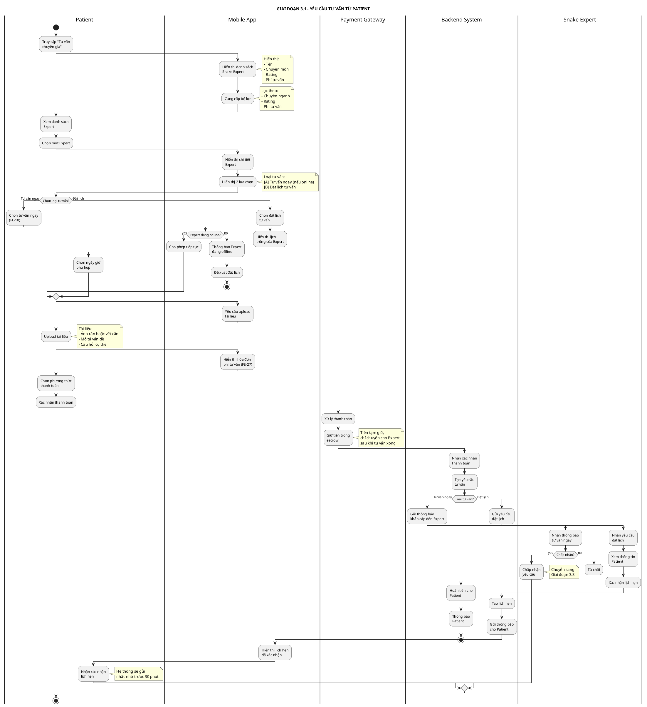
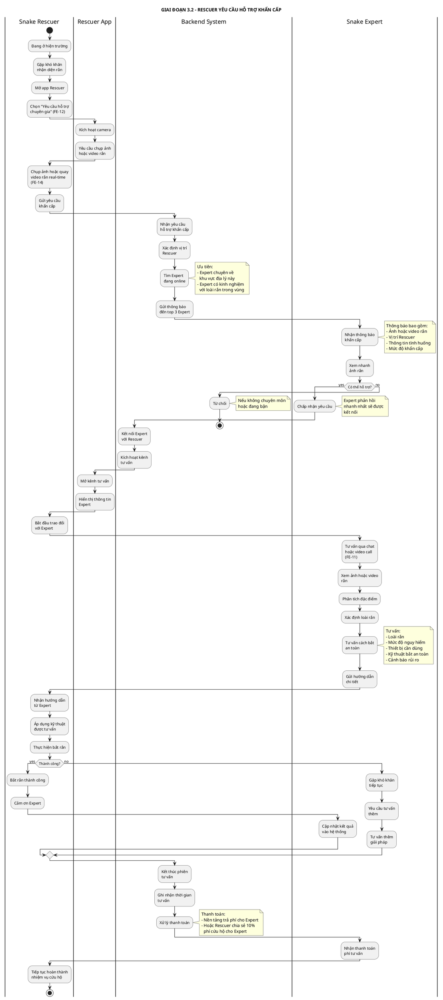
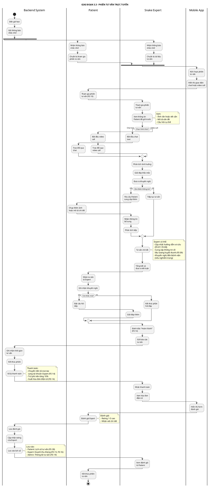
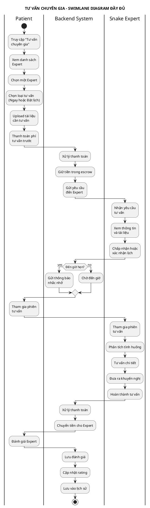

# SWIMLANE DIAGRAM - TƯ VẤN CHUYÊN GIA

## Thông tin dự án
- **Tên dự án:** AI-Powered Platform for Snakebite First Aid and Rescue Support (SnakeAid)
- **Module:** Expert Consultation
- **Mục đích:** Minh họa quy trình tư vấn chuyên gia từ Patient và hỗ trợ khẩn cấp cho Rescuer

---

## SWIMLANE DIAGRAM - LUỒNG CHÍNH (CHIA NHỎ THEO GIAI ĐOẠN)

### 3.1. GIAI ĐOẠN 1: YÊU CẦU TƯ VẤN TỪ PATIENT

**PlantUML Code:**

---

### 3.2. GIAI ĐOẠN 2: RESCUER YÊU CẦU HỖ TRỢ KHẨN CẤP

**PlantUML Code:**

---

### 3.3. GIAI ĐOẠN 3: PHIÊN TƯ VẤN TRỰC TUYẾN

**PlantUML Code:**

---

## TÓM TẮT CÁC GIAI ĐOẠN

| Giai đoạn | Tên | Actors chính | Thời gian ước tính |
|-----------|-----|--------------|-------------------|
| **3.1** | Yêu cầu tư vấn từ Patient | Patient, Mobile App, Snake Expert | 2-3 phút |
| **3.2** | Rescuer yêu cầu hỗ trợ khẩn cấp | Snake Rescuer, Snake Expert, Backend | 5-10 phút |
| **3.3** | Phiên tư vấn trực tuyến | Patient, Snake Expert, Backend | 15-30 phút |

---

## SWIMLANE DIAGRAM TỔNG HỢP (TẤT CẢ CÁC GIAI ĐOẠN)

### Phiên bản PlantUML đầy đủ

---

## CHÚ THÍCH

### Actors (Vai trò)
- **Patient:** Người dùng cần tư vấn về rắn hoặc vết cắn
- **Snake Rescuer:** Đội cứu hộ cần hỗ trợ khẩn cấp từ chuyên gia
- **Snake Expert:** Chuyên gia về rắn và nọc độc
- **Mobile App:** Ứng dụng di động SnakeAid
- **Rescuer App:** Ứng dụng dành cho đội cứu hộ
- **Backend System:** Hệ thống backend xử lý matching và thanh toán
- **Payment Gateway:** Cổng thanh toán (Momo, VNPay, ZaloPay)

### Các trường hợp đặc biệt
1. **Tư vấn ngay nhưng Expert offline:** Hệ thống đề xuất đặt lịch hoặc chọn Expert khác
2. **Expert từ chối yêu cầu tư vấn ngay:** Hoàn tiền cho Patient và đề xuất Expert khác
3. **Rescuer cần tư vấn khẩn cấp:** Ưu tiên cao nhất, gửi đến top 3 Expert online
4. **Thanh toán giữ trong escrow:** Chỉ chuyển cho Expert sau khi hoàn thành tư vấn
5. **Patient không hài lòng:** Có thể khiếu nại trong vòng 24 giờ để được xem xét hoàn tiền

### Loại hình tư vấn
1. **Tư vấn ngay (Instant Consultation):**
   - Expert phải online
   - Phản hồi trong vòng 2 phút
   - Phí cao hơn 20-30% so với đặt lịch
   
2. **Đặt lịch (Scheduled Consultation):**
   - Có thể đặt trước 24-48 giờ
   - Expert xác nhận lịch
   - Gửi nhắc nhở trước 30 phút
   
3. **Tư vấn khẩn cấp cho Rescuer:**
   - Miễn phí hoặc nền tảng chi trả
   - Ưu tiên cao nhất
   - Expert có kinh nghiệm với khu vực

### API Endpoints liên quan
- `GET /api/experts` - Lấy danh sách chuyên gia
- `POST /api/consultation/request` - Tạo yêu cầu tư vấn
- `POST /api/consultation/accept` - Expert chấp nhận yêu cầu
- `POST /api/consultation/schedule` - Đặt lịch tư vấn
- `POST /api/consultation/start` - Bắt đầu phiên tư vấn
- `POST /api/consultation/complete` - Hoàn thành tư vấn
- `POST /api/consultation/emergency` - Yêu cầu tư vấn khẩn cấp (Rescuer)
- `POST /api/payment/escrow` - Giữ tiền trong escrow
- `POST /api/payment/release` - Giải ngân cho Expert
- `POST /api/rating/expert` - Đánh giá chuyên gia

### Chuyên môn của Expert
1. **Rắn độc Việt Nam:** Chuyên về các loài rắn bản địa
2. **Rắn ngoại lai:** Chuyên về rắn nhập khẩu, rắn cảnh
3. **Điều trị nọc độc:** Bác sĩ chuyên về xử lý vết cắn rắn độc
4. **Sinh thái rắn:** Chuyên về hành vi, môi trường sống
5. **Cứu hộ rắn:** Kỹ thuật bắt rắn an toàn

---

**Ghi chú:** Các feature code (FE-XX) tham chiếu đến file `Major-Features-Summary.md`
