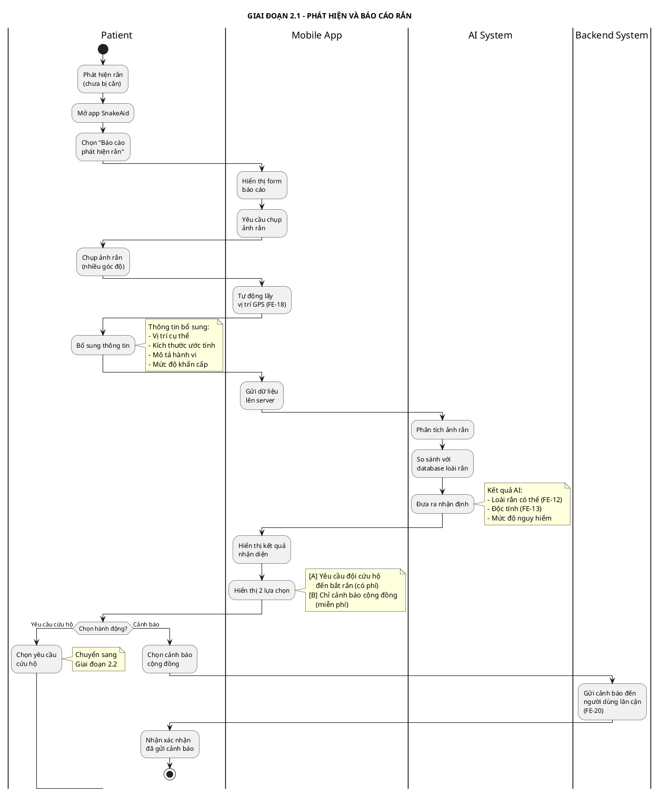
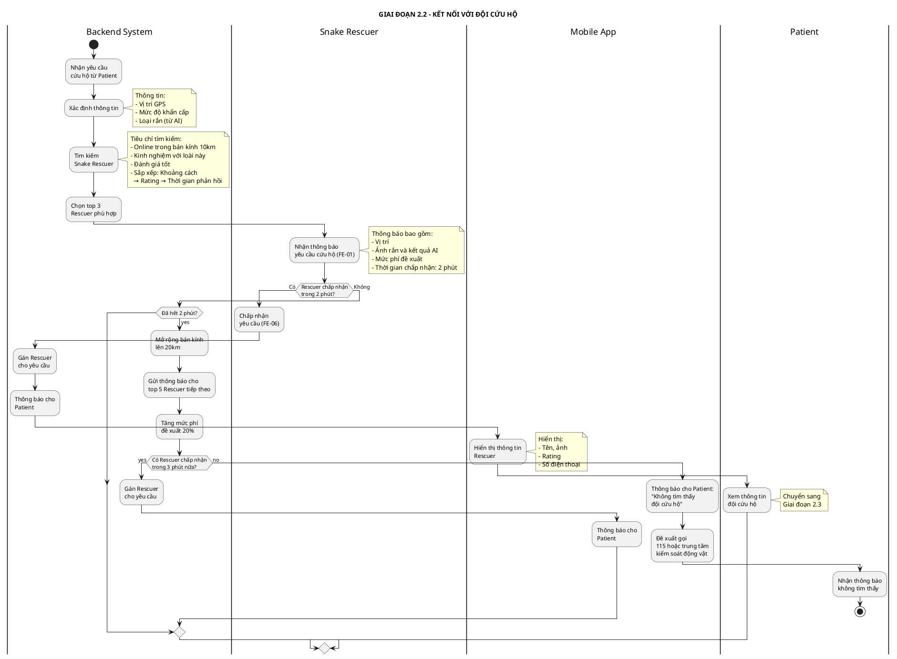
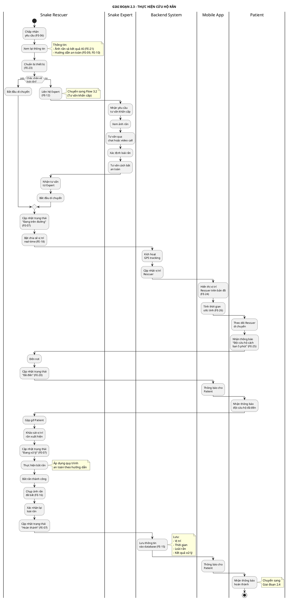
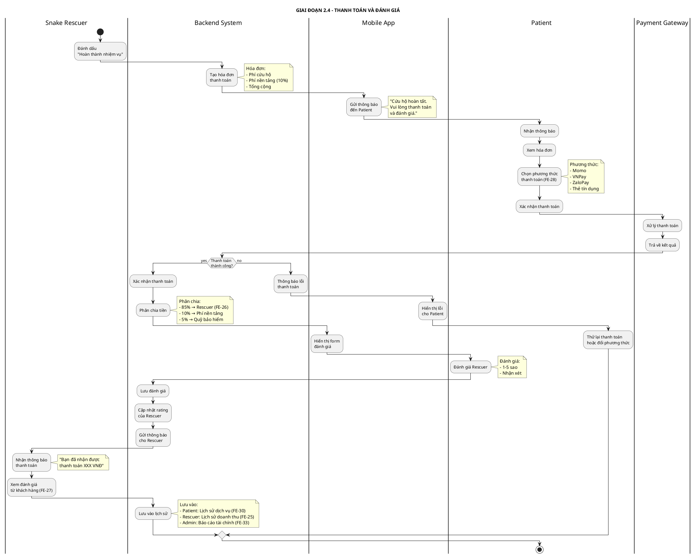
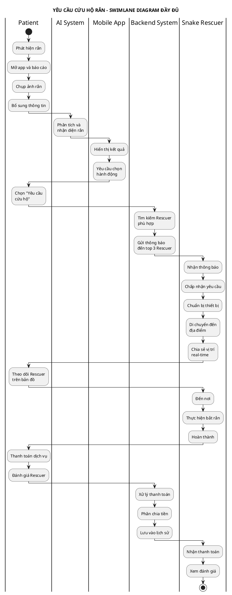

# SWIMLANE DIAGRAM - YÊU CẦU CỨU HỘ RẮN

## Thông tin dự án
- **Tên dự án:** AI-Powered Platform for Snakebite First Aid and Rescue Support (SnakeAid)
- **Module:** Snake Rescue Request & Matching
- **Mục đích:** Minh họa quy trình từ khi người dùng phát hiện rắn đến khi đội cứu hộ hoàn thành nhiệm vụ

---

## SWIMLANE DIAGRAM - LUỒNG CHÍNH (CHIA NHỎ THEO GIAI ĐOẠN)

### 2.1. GIAI ĐOẠN 1: PHÁT HIỆN VÀ BÁO CÁO RẮN

**PlantUML Code:**

---

### 2.2. GIAI ĐOẠN 2: KẾT NỐI VỚI ĐỘI CỨU HỘ (MATCHING)

**PlantUML Code:**

---

### 2.3. GIAI ĐOẠN 3: THỰC HIỆN CỨU HỘ

**PlantUML Code:**

---

### 2.4. GIAI ĐOẠN 4: THANH TOÁN VÀ ĐÁNH GIÁ

**PlantUML Code:**

---

## TÓM TẮT CÁC GIAI ĐOẠN

| Giai đoạn | Tên | Actors chính | Thời gian ước tính |
|-----------|-----|--------------|-------------------|
| **2.1** | Phát hiện và báo cáo rắn | Patient, Mobile App, AI System | 1-2 phút |
| **2.2** | Kết nối với đội cứu hộ | Backend System, Snake Rescuer | 2-5 phút |
| **2.3** | Thực hiện cứu hộ | Snake Rescuer, Patient, Backend | 15-60 phút |
| **2.4** | Thanh toán và đánh giá | Patient, Snake Rescuer, Payment Gateway | 2-3 phút |

---

## SWIMLANE DIAGRAM TỔNG HỢP (TẤT CẢ CÁC GIAI ĐOẠN)

### Phiên bản PlantUML đầy đủ

---

## CHÚ THÍCH

### Actors (Vai trò)
- **Patient:** Người dùng phát hiện rắn và yêu cầu cứu hộ
- **Mobile App:** Ứng dụng di động SnakeAid
- **AI System:** Hệ thống AI nhận diện rắn
- **Backend System:** Hệ thống backend xử lý matching và thanh toán
- **Snake Rescuer:** Đội cứu hộ rắn chuyên nghiệp
- **Snake Expert:** Chuyên gia tư vấn về rắn (nếu cần)
- **Payment Gateway:** Cổng thanh toán (Momo, VNPay, ZaloPay)

### Các trường hợp đặc biệt
1. **Không tìm thấy Rescuer:** Hệ thống mở rộng bán kính tìm kiếm và tăng phí đề xuất
2. **Rescuer cần tư vấn Expert:** Chuyển sang Flow 3.2 để được hỗ trợ khẩn cấp
3. **Thanh toán thất bại:** Patient có thể thử lại hoặc đổi phương thức thanh toán
4. **Chỉ cảnh báo cộng đồng:** Không tính phí, chỉ gửi thông báo đến người dùng lân cận

### API Endpoints liên quan
- `POST /api/rescue/request` - Tạo yêu cầu cứu hộ
- `GET /api/rescue/find-rescuers` - Tìm đội cứu hộ phù hợp
- `POST /api/rescue/accept` - Rescuer chấp nhận yêu cầu
- `PUT /api/rescue/status` - Cập nhật trạng thái cứu hộ
- `POST /api/rescue/complete` - Đánh dấu hoàn thành
- `POST /api/payment/process` - Xử lý thanh toán
- `POST /api/rating/submit` - Gửi đánh giá

---

**Ghi chú:** Các feature code (FE-XX) tham chiếu đến file `Major-Features-Summary.md`
