# CONTEXT DIAGRAM - SNAKEAID SYSTEM

## Thông tin tài liệu
- **Tên dự án:** SnakeAid - AI-Powered Platform for Snakebite First Aid and Rescue Support
- **Loại sơ đồ:** Context Diagram (Level 0 - System Context)
- **Mục đích:** Mô tả tổng quan hệ thống và các tương tác với external entities
- **Ngày tạo:** December 1, 2025

---

## 📐 CONTEXT DIAGRAM

### PlantUML Code:

```plantuml
@startuml SnakeAid-Context-Diagram

skinparam rectangle {
    BackgroundColor #FFFFFF
    BorderColor #333333
    FontSize 13
}

' Äổi từ skinparam ellipse sang skinparam usecase để đồng bá»™
skinparam usecase {
    BackgroundColor #D3D3D3
    BorderColor #000000
    FontSize 14
    FontStyle bold
}

skinparam arrow {
    Color #000000
    FontSize 11
    FontColor #000000
}

title CONTEXT DIAGRAM - SNAKEAID SYSTEM

rectangle "Patient" as Patient
rectangle "Rescuer" as Rescuer
rectangle "Expert" as Expert
rectangle "Admin" as Admin
rectangle "AI System" as AI
rectangle "Payment System" as Payment

usecase "SnakeAid\nPlatform" as SnakeAid

Patient -[hidden]right- Rescuer
Expert -[hidden]right- Admin
AI -[hidden]down- Payment

Patient --> SnakeAid : SOS emergency
Patient --> SnakeAid : Snake image
Patient --> SnakeAid : Rescue request
SnakeAid --> Patient : First aid guide
SnakeAid --> Patient : AI identification
SnakeAid --> Patient : Rescuer tracking

Rescuer --> SnakeAid : Accept rescue
Rescuer --> SnakeAid : GPS location
SnakeAid --> Rescuer : Rescue alert
SnakeAid --> Rescuer : Patient location

Expert --> SnakeAid : Consultation
SnakeAid --> Expert : Consultation request

Admin --> SnakeAid : Manage data
SnakeAid --> Admin : Reports

SnakeAid --> AI : Snake image
AI --> SnakeAid : Species ID

SnakeAid --> Payment : Payment request
Payment --> SnakeAid : Confirmation

@enduml
```



---

## 📊 DATA FLOW SUMMARY

### 1. PATIENT → SNAKEAID → AI SYSTEM

```
Patient uploads snake image
    ↓
SnakeAid receives image + GPS
    ↓
Forward to AI System for identification
    ↓
AI returns: Species, confidence, toxicity
    ↓
SnakeAid displays result to Patient
    ↓
Provide appropriate first aid guidance
```

### 2. PATIENT → SNAKEAID → RESCUER → PAYMENT

```
Patient reports snake sighting
    ↓
SnakeAid matches nearest available Rescuer
    ↓
Rescuer accepts and navigates to location
    ↓
Real-time GPS tracking shared with Patient
    ↓
Rescuer completes snake capture
    ↓
Patient confirms completion
    ↓
SnakeAid initiates payment via Payment System
    ↓
85% to Rescuer, 10% platform fee, 5% insurance
```

### 3. PATIENT → SNAKEAID → EXPERT → PAYMENT

```
Patient requests expert consultation
    ↓
SnakeAid shows available Experts
    ↓
Patient selects Expert and pays (escrow)
    ↓
Expert provides consultation (chat/video)
    ↓
Consultation completed
    ↓
Payment released from escrow to Expert
    ↓
Patient rates Expert
```

### 4. ADMIN → SNAKEAID → AI SYSTEM

```
Admin uploads new snake images
    ↓
SnakeAid stores in database
    ↓
Syncs with AI System for retraining
    ↓
AI Model updated with new data
    ↓
Improved identification accuracy
    ↓
All apps get updated snake database
```

---

## 🔄 INTERACTION MATRIX

| From \ To | Patient | Rescuer | Expert | Admin | AI System | Payment |
|-----------|---------|---------|--------|-------|-----------|---------|
| **Patient** | - | Request rescue | Request consult | - | Upload image | Initiate payment |
| **Rescuer** | Status updates | - | Request help | Report | Upload image | Receive payment |
| **Expert** | Consultation | Advice | - | Verify data | - | Receive payment |
| **Admin** | Send alerts | Assign tasks | Review | - | Train model | Configure fees |
| **AI System** | Return results | Risk warning | - | Analytics | - | - |
| **Payment** | Receipt | Payout | Payout | Reports | - | - |

---

## 📝 EXTERNAL ENTITIES DESCRIPTION

### 1. 👤 PATIENT (Người bị rắn cắn / Người phát hiện rắn)

**Vai trò:** External user nhận hỗ trợ từ hệ thống

**Responsibilities:**
- Báo cáo sự cố rắn cắn khẩn cấp
- Upload ảnh rắn và vết cắn
- Nhập triệu chứng
- Kích hoạt SOS khi nguy kịch
- Yêu cầu cứu hộ bắt rắn
- Yêu cầu tư vấn chuyên gia
- Thanh toán dịch vụ
- Đánh giá Rescuer/Expert

**Inputs to System:**
- Emergency alerts (SOS button)
- Snake images, bite wound images
- Symptom descriptions
- GPS location
- Rescue requests
- Consultation requests
- Payment confirmations
- Ratings and reviews

**Outputs from System:**
- First aid guidance (step-by-step)
- AI identification results
- Severity assessment
- Hospital locations (map)
- Rescuer tracking (real-time GPS)
- Expert consultation
- Payment receipts
- Community alerts

---

### 2. 🚑 RESCUER (Đội cứu hộ rắn)

**Vai trò:** Service provider thực hiện bắt rắn

**Responsibilities:**
- Nhận và chấp nhận yêu cầu cứu hộ
- Di chuyển đến hiện trường
- Chia sẻ vị trí GPS real-time
- Bắt rắn an toàn
- Báo cáo kết quả
- Yêu cầu hỗ trợ Expert nếu cần
- Nhận thanh toán sau khi hoàn thành

**Inputs to System:**
- Accept/reject rescue requests
- GPS location updates (real-time)
- Status updates (en route, arrived, completed)
- Snake capture photos
- Species confirmation
- Expert help requests

**Outputs from System:**
- Rescue request notifications
- Patient location and details
- AI identification results
- Safety guidelines (SOP)
- Map navigation
- Expert consultation
- Payment confirmations
- Revenue reports

---

### 3. 👨‍⚕️ EXPERT (Chuyên gia rắn)

**Vai trò:** Knowledge provider xác minh và tư vấn

**Responsibilities:**
- Xác minh kết quả AI
- Tư vấn trực tuyến cho Patient
- Hỗ trợ khẩn cấp cho Rescuer
- Cập nhật hướng dẫn điều trị
- Cập nhật thông tin loài rắn
- Nhận thanh toán phí tư vấn

**Inputs to System:**
- Verification confirmations
- Consultation messages (chat/video)
- Updated treatment guidelines
- Species confirmation
- Safety recommendations

**Outputs from System:**
- Verification requests (images)
- Consultation requests from Patient
- Emergency help requests from Rescuer
- Snake database for reference
- Payment confirmations
- Revenue reports

---

### 4. 👨‍💼 ADMIN (Quản trị viên)

**Vai trò:** System administrator quản lý toàn bộ platform

**Responsibilities:**
- Quản lý user accounts (Patient, Rescuer, Expert)
- Quản lý database loài rắn
- Quản lý cơ sở y tế (bệnh viện)
- Cấu hình phí dịch vụ
- Giám sát hoạt động real-time
- Gửi cảnh báo cộng đồng
- Xử lý tranh chấp
- Quản lý tài chính nền tảng
- Xuất báo cáo định kỳ

**Inputs to System:**
- User management (create, update, delete)
- Snake database entries (images, info)
- Hospital data (location, antivenom)
- Service fee configurations
- Community alerts
- Dispute resolutions
- Refund approvals

**Outputs from System:**
- Real-time monitoring dashboard
- System activity logs
- Heat maps (incident distribution)
- Financial reports (revenue, payouts)
- Performance analytics (response time)
- System health alerts
- Transaction histories

---

### 5. 🤖 AI SYSTEM (Hệ thống trí tuệ nhân tạo)

**Vai trò:** External service cung cấp AI processing

**Responsibilities:**
- Nhận diện loài rắn từ ảnh (CNN Model)
- Đánh giá mức độ nghiêm trọng từ vết cắn + triệu chứng
- Phân tích xu hướng sự cố (cho Admin)
- Học từ dữ liệu mới (continuous learning)

**Inputs from System:**
- Snake images (for identification)
- Bite wound images + symptom data
- New training data from Admin
- Feedback data (correct/incorrect identification)

**Outputs to System:**
- Snake species identification
  - Scientific name
  - Common name
  - Confidence score (%)
  - Toxicity level
- Severity assessment
  - Severity score (0-100)
  - Risk level (Mild/Moderate/Severe/Critical)
  - Recommended action
- Trend analysis
  - Hot zones (geographic)
  - Seasonal patterns
  - Most common species

**Technology:**
- CNN (Convolutional Neural Network) cho image recognition
- Computer Vision cho bite wound analysis
- Machine Learning cho severity assessment
- Integration: REST API hoặc gRPC

---

### 6. 💳 PAYMENT SYSTEM (Hệ thống thanh toán)

**Vai trò:** External service xử lý giao dịch tài chính

**Responsibilities:**
- Xử lý thanh toán từ Patient
- Tạm giữ tiền (escrow) cho tư vấn
- Chuyển tiền cho Rescuer/Expert
- Hoàn tiền nếu có tranh chấp
- Xuất hóa đơn điện tử
- Gửi webhook notification về trạng thái thanh toán

**Inputs from System:**
- Payment requests
  - Amount (VNĐ)
  - Payer (Patient ID)
  - Payee (Rescuer/Expert ID)
  - Service type (rescue/consultation)
- Refund requests
- Transaction status queries

**Outputs to System:**
- Payment confirmations
  - Transaction ID
  - Status (success/failed/pending)
  - Timestamp
- Webhook notifications
  - Real-time payment status updates
- E-invoices (electronic receipts)
- Transaction histories
- Error messages (failed payments)

**Providers:**
- Momo
- VNPay
- ZaloPay
- Credit/Debit cards (Visa, Mastercard)

**Integration:**
- REST API
- Webhook callbacks
- OAuth 2.0 authentication
- Encryption: SSL/TLS

---

## 🔐 SYSTEM BOUNDARIES

### What's INSIDE the SnakeAid Platform:

✅ **Core Business Logic:**
- Emergency flow management
- Rescuer matching algorithm
- Expert scheduling
- Real-time GPS tracking
- Notification service
- User authentication & authorization
- Database management (users, snakes, hospitals)
- Content management (education, alerts)
- Analytics & reporting engine

✅ **Data Storage:**
- User profiles
- Snake database
- Hospital database
- Emergency cases
- Transaction histories
- Consultation records
- System logs

✅ **Application Layer:**
- Mobile app for Patient (iOS/Android)
- Mobile app for Rescuer (iOS/Android)
- Mobile app for Expert (iOS/Android)
- Web app for Admin (ReactJS)
- Backend APIs (.NET)

---

### What's OUTSIDE (External Dependencies):

❌ **AI Processing:**
- Image recognition (CNN models)
- Severity assessment algorithms
- Training infrastructure

❌ **Payment Gateway:**
- Transaction processing
- Fraud detection
- PCI compliance
- E-invoicing

❌ **Third-party Services:**
- SMS gateway (for emergency alerts)
- Push notification service (Firebase)
- Map services (Google Maps API)
- Cloud storage (Azure Blob Storage)
- Video call infrastructure (WebRTC or Agora)

---

## 📐 CONTEXT DIAGRAM (ASCII Alternative)

```
                                   ┌──────────────────┐
                                   │   AI SYSTEM      │
                                   │  🤖 CNN Model    │
                                   └────────┬─────────┘
                                            │
                    ┌───────────────────────┼───────────────────────┐
                    │                       │                       │
                    │      [Images]         │      [Results]        │
                    │                       │                       │
   ┌────────────┐   │   ┌───────────────────▼───────────────────┐   │   ┌────────────┐
   │  PATIENT   │◄──┼───┤                                        ├───┼──►│  PAYMENT   │
   │     👤      │   │   │       SNAKEAID PLATFORM 🏥           │   │   │  SYSTEM 💳 │
   │            ├───┼──►│                                        │◄──┼───┤            │
   └────────────┘   │   │  • Emergency Management                │   │   └────────────┘
                    │   │  • Rescuer Matching                    │   │
   ┌────────────┐   │   │  • Expert Consultation                 │   │
   │  RESCUER   │◄──┼───┤  • GPS Tracking                        │   │
   │     🚑      │   │   │  • Hospital Finder                     │   │
   │            ├───┼──►│  • Payment Processing                  │   │
   └────────────┘   │   │  • Real-time Monitoring                │   │
                    │   │  • Community Alerts                    │   │
   ┌────────────┐   │   │                                        │   │
   │   EXPERT   │◄──┼───┤                                        │   │
   │    👨‍⚕️      │   │   │                                        │   │
   │            ├───┼──►│                                        │   │
   └────────────┘   │   └────────────────────────────────────────┘   │
                    │                       ▲                       │
   ┌────────────┐   │                       │                       │
   │   ADMIN    │◄──┼───────────────────────┼───────────────────────┘
   │    👨‍💼      │   │         [Management & Monitoring]
   │            ├───┼──►
   └────────────┘   │
                    │
                    └─────────────────── System Boundary ───────────────────
```

---

## 🎯 KEY INTERACTIONS

### Critical Path 1: Emergency Snakebite

```
Patient → SOS Button → SnakeAid
                         ↓
                    Match Rescuer
                         ↓
              Rescuer ← Notification
                         ↓
              GPS Tracking ↔ SnakeAid ↔ Patient
                         ↓
                   Rescue Complete
                         ↓
              SnakeAid → Payment System
                         ↓
              Patient pays → Rescuer receives
```

### Critical Path 2: AI Snake Identification

```
Patient → Upload Snake Image → SnakeAid
                                   ↓
                            Forward to AI System
                                   ↓
                            AI processes (CNN)
                                   ↓
                         Return: Species + Toxicity
                                   ↓
                    SnakeAid → Display to Patient
                                   ↓
                    Provide First Aid Guidance
```

### Critical Path 3: Expert Consultation

```
Patient → Request Consultation → SnakeAid
                                    ↓
                          Match available Expert
                                    ↓
                    Patient pays (escrow) → Payment System
                                    ↓
                    Expert ← Notification
                                    ↓
                    Consultation Session (Chat/Video)
                                    ↓
                          Session Complete
                                    ↓
              Payment System → Release funds to Expert
```

---

## 📊 SYSTEM STATISTICS

### Volume Estimates:

| Metric | Expected Volume | Peak Volume |
|--------|----------------|-------------|
| Patient users | 50,000+ | 100,000+ |
| Active Rescuers | 500+ | 1,000+ |
| Active Experts | 50+ | 100+ |
| Daily emergency cases | 20-50 | 100+ |
| Daily rescue requests | 30-80 | 150+ |
| Daily consultations | 10-30 | 50+ |
| AI identifications/day | 100-300 | 500+ |
| Payment transactions/day | 40-100 | 200+ |

---

## 🔧 TECHNOLOGY STACK

### SnakeAid Platform:
- **Backend:** .NET Core, Azure/AWS
- **Database:** SQL Server / MySQL
- **Web Client:** ReactJS, TypeScript
- **Mobile:** Flutter / Xamarin
- **Real-time:** SignalR / Socket.IO

### AI System:
- **Framework:** TensorFlow / PyTorch
- **Model:** CNN (Convolutional Neural Network)
- **Deployment:** Azure ML / AWS SageMaker

### Payment System:
- **Providers:** Momo, VNPay, ZaloPay
- **Integration:** REST API, Webhooks
- **Security:** PCI-DSS compliant

---

## 📝 NOTES

1. **Scalability:** System được thiết kế để scale horizontally với microservices architecture
2. **Security:** All external communications encrypted (SSL/TLS)
3. **Availability:** Target 99.9% uptime cho emergency features
4. **Performance:** AI identification < 5 seconds, Rescuer matching < 30 seconds
5. **Compliance:** GDPR/PDPA compliant cho personal data protection

---

**Version:** 1.0  
**Author:** AI Assistant  
**Date:** December 1, 2025  
**Status:** ✅ Ready for Review
